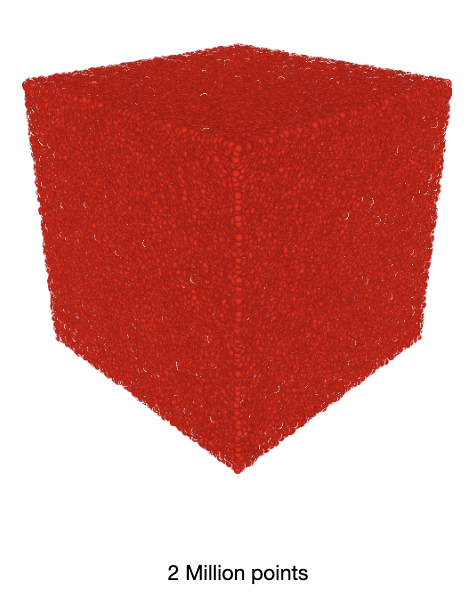
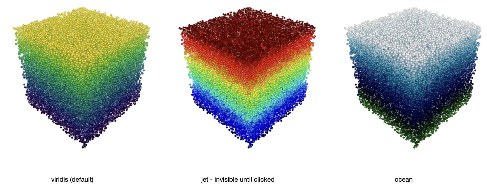

# JupyThree

A Jupyter widget based on pythreejs to display massive pointclouds (millions of points)
with **excellent interactive speed**. Also handles triangular meshes, with easy per-vertex color or scalar field.

```python
import numpy as np
from jupythree.pointcloud import pointcloud

N = 2000000 #<-- two million points
x = np.random.random((N,3))/2 - 0.25 # cube

pointcloud(x).show(title="2 Million points")
```





## Installation

1. Through pip:

```
pip install jupythree
```

2. Or, you can clone this repo and install requirements

```
git clone https://github.com/groscot/jupythree
cd jupythree
pip install -r requirements.txt
```

## Usage

Run the included Notebook `Jupythree Demo.ipynb`


## Quick reference guide

You can easily copy-paste these snippets (`x` contains a `(N,3)` array, `V` and `F` are vertices and faces of a mesh)

```python
# Useful imports
from jupythree.pointcloud import pointcloud
from jupythree.mesh import mesh
from jupythree.window import window

# For pointclouds
pointcloud(x).show()
pointcloud(x, color=x).show()
pointcloud(x).show(title="Window title", width=500, height=500)
pointcloud(x).with_slider().show()

# For animations
pointcloud_handle = pointcloud(x)
pointcloud_handle.show(title="This window will animate")
# and then, in another cell
pointcloud_handle.update(x2)

# For meshes
mesh(V, F).show()
mesh(V, F, vertex_color=V[:,0]).show()
mesh(
 V,
 F,
 constant_color=u"#00aaff",
 lineopacity=1.,
 linecolor=u"#ff0000"
).show()

# Combining multiple objects (pointclouds and/or meshes)
window(pointcloud(x), mesh(V, F)).show()
```

## Requirements

- pythreejs
- numpy
- ipywidgets
- matplotlib (for colormaps)

## Some nice features:

1. Handles millions of points while keeping interactive rotation and zoom
2. RGB colors + real values with matplotlib colormaps
3. Slider controlling the radius: `pointcloud(x).with_slider().show()`
4. Realtime animations: create and display the pointcloud with one cell (`handle = pointcloud(x1); handle.show()`), animate it from any other cell of your notebook (`handle.update(pc=x2)`)
5. Triangular meshes with vertex colors: `mesh(V, F, vertex_color=V[:,0]).show()`

## Known issues:

- In recent versions of Jupyter, you will have a warning when displaying the first pointcloud of a session. It affects other libraries based on WebGL (such as plotly). You can safely ignore this message.

```
UserWarning: Message serialization failed with:
Out of range float values are not JSON compliant
Supporting this message is deprecated in jupyter-client 7, please make sure your message is JSON-compliant
  content = self.pack(content)
```

- The widgets are non persistent, meaning that they won't appear when you reopen a saved notebook